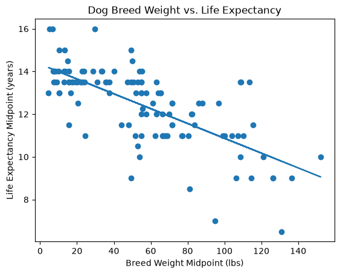

# Dog-Breed-Weight-and-Life-Expectancy

## Project Overview 

I wanted to explore whether the weight of a dog breed is associated with its life expectancy. Who inspired my project topic? 

### Lola and Oreo 

I want my dogs to live furever, but I also know that is not a possibility. Their difference in breed and size leave me wondering if they will grow old together or if one will outlive the other. 

## Foundational Question 
Is dog breed weight associated with life expectancy? 

## Data Gathering Process

I gathered my data from the Dog Weight Breed Directory:
https://dog-weight.com/breed-directory/

Instead of using a preexisting dataset, I scraped the information directly from the website using Python. I used the `requests` library to access the website and `BeautifulSoup` to parse the HTML.

I first used the breed directory to collect the links for each individual dog breed page. Each breed page contained separate weight ranges for male and female dogs, as well as life expectancy ranges.

Since the website provided ranges instead of a single value, I calculated the midpoint of each range. I then combined the male and female midpoints to create one weight midpoint and one life expectancy midpoint for each breed.

After gathering and cleaning the data, I stored it in a SQLite database called `dog_breeds.db`. My final database contains 117 dog breeds.

## Database

The data was stored in a SQLite table called `dog_breeds`.

The table contains:
- `breed_name` - Name of the dog breed
- `weight_midpoint_lbs` - Calculated breed weight midpoint in pounds
- `life_midpoint_years` - Calculated life expectancy midpoint in years

The breed name is used as the primary key.

## Analysis Process

I created `main.py` to connect to my SQLite database and retrieve the breed name, weight midpoint, and life expectancy midpoint for all 117 breeds.

I separated the weight and life expectancy values and used Pearson correlation to measure the relationship between the two variables. I also created a scatterplot to visualize the relationship between breed weight and life expectancy. I added a line of best fit to make the overall trend easier to see.

## Results

The Pearson correlation between dog breed weight and life expectancy was:

**r = -0.703**

The negative correlation shows that as breed weight increases, life expectancy tends to decrease. In this dataset, heavier dog breeds generally had shorter life expectancies than lighter dog breeds. 
I want to make it clear that the correlation results does not mean that the breed weight directly causes a shorter life expectancy. 

### Visualization

## AI Use and Challenges

I used ChatGPT throughout this project as a learning, troubleshooting, and debugging tool. Since web scraping, BeautifulSoup, and working with SQLite are still new to me. It helped explain what different parts of the code were doing rather than only providing a completed solution. I worked through the project incrementally by writing and running the code, checking the output, and making changes a long the way. 

I used AI to help me understand how BeautifulSoup parses HTML and how to locate specific elements on a webpage.

I ran into an issue when I tried to manually create a URL for a specific dog breed and received an error because the page did not exist at the URL I expected. With AI assistance, I changed my approach and collected the individual breed URLs directly from the breed directory instead of trying to guess the URLs. I assumed they would have the breed german sheperd ( but out of the 117, german sheperd was not there)

Another challenge was determining how to analyze data that was provided as ranges. AI helped me work through the idea of calculating the midpoint of each range so that I could store numerical values in my database and compare weight with life expectancy. ( i found this very helpful)

Lastly, AI helped me understand and debug my SQLite database and Git/GitHub workflow. 

